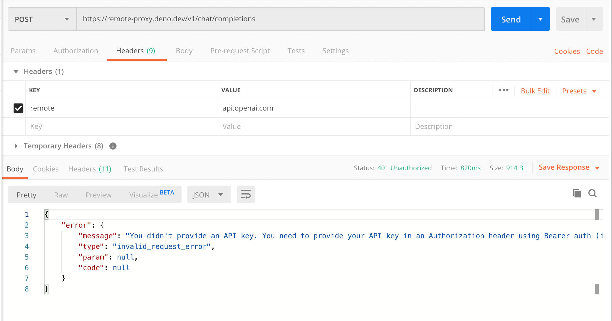

# 免翻墙代理

<span style="color:gray"> 
根据fork项目改造，如需直接使用请访问源项目
</span><br>

## 使用

需要在请求头添加
```
"remote":${原请求host}
```
并把原url的host替换成你部署的公网host

以openai请求为例：


# 以下为原项目介绍


据很多网友反应，**OpenAI 检测到中国的 API
访问时，会直接封号**。所以我在国外的服务器上搭建了一个代理，用于访问
OpenAI/ChatGPT 的 API。

## 使用

使用 OpenAI/ChatGPT 官方 npm 包：

```diff
import { Configuration } from "openai";

const configuration = new Configuration({
  apiKey: OPENAI_API_KEY,
+ basePath: "https://closeai.deno.dev/v1",
});
```

使用 OpenAI/ChatGPT 官方 Python 包：

```diff
  import openai

  openai.api_key = os.getenv("OPENAI_API_KEY")
+ openai.api_base = "https://closeai.deno.dev/v1"
```

## 相关仓库

- [ChatGPT 从入门到精通](https://github.com/justjavac/chatgpt)

## 本地开发

```bash
deno run --allow-net --allow-read --allow-env --watch main.ts
```

## 自己部署

点击[这个链接][1]，可以快速一键部署到 Deno Deploy 上。

然后在 Settings 选项卡里可以设置自定义二级域名，或者绑定自己的域名。

[1]: https://dash.deno.com/new?url=https://raw.githubusercontent.com/justjavac/openai-proxy/main/main.ts
